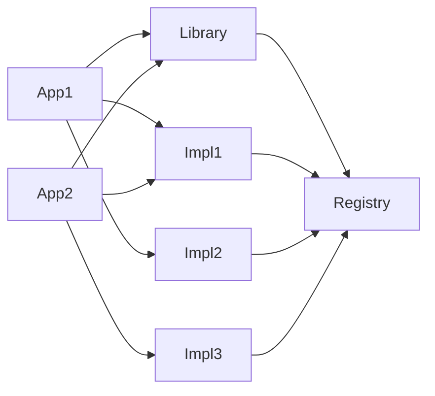

This project is a demonstration of an idea that closure-compiler doesn't seem to be able to follow all the time. 
A simple interface is declared, with a registry to declare and look up instances. Libraries can depend on the interface
and registry itself, but usually won't specify implementations. In turn, an application will specify the library, and
any implementations of the underlying interface.


Each different application might depend on different implementations, and use runtime logic, or `define`s to pick a
specific implementation at build time. 

The part that doesn't work consistently is using defines for this. For example, suppose that this is our registry:
```javascript
var map = {};
function register(key, creator) {
    map[key] = creator;
}
function lookup(key) {
    return map[key]();
}


// Specify a default, and allow it to be overridden at build time
/** @define {string} */
const exampleDefault = goog.define('exampleDefault', 'python');
function lookupDefault() {
    return lookup(exampleDefault);
}
```
and a simple interface to implement
```javascript
/**
 * 
 * @interface
 */
function ProgrammingLanguage() {
    
}
/**
 * @return {string}
 */
ProgrammingLanguage.prototype.getName = function() {};
```

Then, we have two implementations, which register themselves (rather than require that our application write code for
each implementation):
```javascript
/**
 * 
 * @constructor
 * @implements ProgrammingLanguage
 */
function PythonLanguage() {
    
}
PythonLanguage.prototype.getName = function() {
    return "Python";
};
register("python", () => new PythonLanguage());
```
```javascript
/**
 *
 * @constructor
 * @implements ProgrammingLanguage
 */
function JavaLanguage() {
    
}
JavaLanguage.prototype.getName = function() {
    return "Java";
};
register("java", () => new JavaLanguage());
```

Now our library can use this any way it wants, and expect to have an instance provided.
```javascript
function sayHello() {
    var defaultLanguage = lookupDefault();
    return "Hello, " + defaultLanguage.getName() + "!";
}
```

Our application need not use the original factory or implementations, as long as it correctly includes their sources
as inputs to closure-compiler, but can just call on the library:

```javascript
console.log(sayHello());
```

Invoking this in closure-compiler from the command line looks like this:
```shell
export CLOSURE_LIBRARY=~/workspace/closure-library/
java -jar closure-compiler-shaded.jar --compilation_level ADVANCED \
  --js src/languages/registry.js \
  --js src/languages/language.js \
  --js src/java/java.js \
  --js src/python/python.js \
  --js src/library/library.js \
  --js src/app.js \
  --js $CLOSURE_LIBRARY/closure/goog/base.js
```

Our naive expectation is that such an application should be optimized out to practically nothing:
```javascript
console.log("Hello, Python!");
```

[Instead, we get this](https://closure-compiler.appspot.com/home#code%3D%252F%252F%2520%253D%253DClosureCompiler%253D%253D%250A%252F%252F%2520%2540compilation_level%2520ADVANCED_OPTIMIZATIONS%250A%252F%252F%2520%2540output_file_name%2520default.js%250A%252F%252F%2520%2540formatting%2520pretty_print%250A%252F%252F%2520%253D%253D%252FClosureCompiler%253D%253D%250Avar%2520map%2520%253D%2520%257B%257D%253B%250Afunction%2520register(key%252C%2520creator)%2520%257B%250A%2520%2520%2520%2520map%255Bkey%255D%2520%253D%2520creator%253B%250A%257D%250Afunction%2520lookup(key)%2520%257B%250A%2520%2520%2520%2520return%2520map%255Bkey%255D()%253B%250A%257D%250A%250A%250A%252F%252F%2520Specify%2520a%2520default%252C%2520and%2520allow%2520it%2520to%2520be%2520overridden%2520at%2520build%2520time%250A%252F**%2520%2540define%2520%257Bstring%257D%2520*%252F%250Aconst%2520exampleDefault%2520%253D%2520goog.define('exampleDefault'%252C%2520'python')%253B%250Afunction%2520lookupDefault()%2520%257B%250A%2520%2520%2520%2520return%2520lookup(exampleDefault)%250A%257D%250A%250A%252F**%250A%2520*%250A%2520*%2520%2540interface%250A%2520*%252F%250Afunction%2520ProgrammingLanguage()%2520%257B%250A%250A%257D%250AProgrammingLanguage.prototype.getName%2520%253D%2520function()%2520%257B%257D%253B%250A%250A%252F**%250A%2520*%2520%250A%2520*%2520%2540constructor%250A%2520*%252F%250Afunction%2520PythonLanguage()%2520%257B%250A%250A%257D%250A%250APythonLanguage.prototype.getName%2520%253D%2520function()%2520%257B%250A%2520%2520%2520%2520return%2520%2522Python%2522%253B%250A%257D%253B%250Aregister(%2522python%2522%252C%2520()%2520%253D%253E%2520new%2520PythonLanguage())%253B%250A%250A%252F**%250A%2520*%2520%250A%2520*%2520%2540constructor%250A%2520*%252F%250Afunction%2520JavaLanguage()%2520%257B%250A%250A%257D%250AJavaLanguage.prototype.getName%2520%253D%2520function()%2520%257B%250A%2520%2520%2520%2520return%2520%2522Java%2522%253B%250A%257D%253B%250Aregister(%2522java%2522%252C%2520()%2520%253D%253E%2520new%2520JavaLanguage())%253B%250A%250A%250Afunction%2520sayHello()%2520%257B%250A%2520%2520%2520%2520var%2520defaultLanguage%2520%253D%2520lookupDefault()%253B%250A%2520%2520%2520%2520return%2520%2522Hello%252C%2520%2522%2520%252B%2520defaultLanguage.getName()%2520%252B%2520%2522!%2522%253B%250A%257D%250A%250Aconsole.log(sayHello())%253B%250A) (here using the web service, so that we can easily pretty print the output, and make it
reproducible on other computers):
```javascript
var a = {};
function b() {
}
b.prototype.g = function() {
  return "Python";
};
a.python = function() {
  return new b();
};
function c() {
}
c.prototype.g = function() {
  return "Java";
};
a.java = function() {
  return new c();
};
console.log("Hello, " + a.python().g() + "!");
```

But, if we take that closure output, and run it again, [we do get the correct result](https://closure-compiler.appspot.com/home#code%3D%252F%252F%2520%253D%253DClosureCompiler%253D%253D%250A%252F%252F%2520%2540compilation_level%2520ADVANCED_OPTIMIZATIONS%250A%252F%252F%2520%2540output_file_name%2520default.js%250A%252F%252F%2520%2540formatting%2520pretty_print%250A%252F%252F%2520%253D%253D%252FClosureCompiler%253D%253D%250Avar%2520a%2520%253D%2520%257B%257D%253B%250Afunction%2520b()%2520%257B%250A%257D%250Ab.prototype.g%2520%253D%2520function()%2520%257B%250A%2520%2520return%2520%2522Python%2522%253B%250A%257D%253B%250Aa.python%2520%253D%2520function()%2520%257B%250A%2520%2520return%2520new%2520b()%253B%250A%257D%253B%250Afunction%2520c()%2520%257B%250A%257D%250Ac.prototype.g%2520%253D%2520function()%2520%257B%250A%2520%2520return%2520%2522Java%2522%253B%250A%257D%253B%250Aa.java%2520%253D%2520function()%2520%257B%250A%2520%2520return%2520new%2520c()%253B%250A%257D%253B%250Aconsole.log(%2522Hello%252C%2520%2522%2520%252B%2520a.python().g()%2520%252B%2520%2522!%2522)%253B%250A),
albeit with two warnings for "omitting" our required `@constructor` jsdocs:
```javascript
console.log("Hello, Python!");
```

It seems as though the compiler can tell that an string key could be replaced by a property, but then once it has done
so, it cannot remove unused properties. However, if the input already has that property with no string key, it is safe
to remove the unreachable code. We still want to key this off of `--define`, so this might limit our options somewhat.

Removing the `@define`, and just using a constant string has no effect - this is probably what the compiler is doing already,
so this makes sense. We then tried to go a step further and replace our string literals with either properties, or use
`goog.reflect.objectProperty(...)` to indicate that the given key would correspond to a known property on that object:
```javascript
goog.require('goog.reflect');
//...

// Specify a default, and allow it to be overridden at build time
function lookupDefault() {
    return map[goog.reflect.objectProperty('python', map)]();
    //return lookup('python')
}

//...

map.python = () => new PythonLanguage();
//register("python", () => new PythonLanguage());

//...

map.java = () => new JavaLanguage();
//register("java", () => new JavaLanguage());
```
[This gets us slightly closer](https://closure-compiler.appspot.com/home#code%3D%252F%252F%2520%253D%253DClosureCompiler%253D%253D%250A%252F%252F%2520%2540compilation_level%2520ADVANCED_OPTIMIZATIONS%250A%252F%252F%2520%2540output_file_name%2520default.js%250A%252F%252F%2520%2540formatting%2520pretty_print%250A%252F%252F%2520%2540use_closure_library%2520true%250A%252F%252F%2520%253D%253D%252FClosureCompiler%253D%253D%250Agoog.require('goog.reflect')%253B%250Avar%2520map%2520%253D%2520%257B%257D%253B%250Afunction%2520register(key%252C%2520creator)%2520%257B%250A%2520%2520%2520%2520map%255Bkey%255D%2520%253D%2520creator%253B%250A%257D%250Afunction%2520lookup(key)%2520%257B%250A%2520%2520%2520%2520return%2520map%255Bkey%255D()%253B%250A%257D%250A%250A%250A%252F%252F%2520Specify%2520a%2520default%252C%2520and%2520allow%2520it%2520to%2520be%2520overridden%2520at%2520build%2520time%250Afunction%2520lookupDefault()%2520%257B%250A%2520%2520%2520%2520return%2520map%255Bgoog.reflect.objectProperty('python'%252C%2520map)%255D()%253B%250A%2520%2520%2520%2520%252F%252Freturn%2520lookup('python')%250A%257D%250A%250A%252F**%250A%2520*%250A%2520*%2520%2540interface%250A%2520*%252F%250Afunction%2520ProgrammingLanguage()%2520%257B%250A%250A%257D%250A%252F**%250A%2520*%2520%2540returns%2520%257Bstring%257D%250A%2520*%252F%250AProgrammingLanguage.prototype.getName%2520%253D%2520function()%2520%257B%257D%253B%250A%250A%252F**%250A%2520*%250A%2520*%2520%2540constructor%250A%2520*%2520%2540implements%2520ProgrammingLanguage%250A%2520*%252F%250Afunction%2520PythonLanguage()%2520%257B%250A%250A%257D%250A%250APythonLanguage.prototype.getName%2520%253D%2520function()%2520%257B%250A%2520%2520%2520%2520return%2520%2522Python%2522%253B%250A%257D%253B%250Amap.python%2520%253D%2520()%2520%253D%253E%2520new%2520PythonLanguage()%253B%250A%252F%252Fregister(%2522python%2522%252C%2520()%2520%253D%253E%2520new%2520PythonLanguage())%253B%250A%250A%252F**%250A%2520*%250A%2520*%2520%2540constructor%250A%2520*%2520%2540implements%2520ProgrammingLanguage%250A%2520*%252F%250Afunction%2520JavaLanguage()%2520%257B%250A%250A%257D%250AJavaLanguage.prototype.getName%2520%253D%2520function()%2520%257B%250A%2520%2520%2520%2520return%2520%2522Java%2522%253B%250A%257D%253B%250Amap.java%2520%253D%2520()%2520%253D%253E%2520new%2520JavaLanguage()%253B%250A%252F%252Fregister(%2522java%2522%252C%2520()%2520%253D%253E%2520new%2520JavaLanguage())%253B%250A%250A%250Afunction%2520sayHello()%2520%257B%250A%2520%2520%2520%2520var%2520defaultLanguage%2520%253D%2520lookupDefault()%253B%250A%2520%2520%2520%2520return%2520%2522Hello%252C%2520%2522%2520%252B%2520defaultLanguage.getName()%2520%252B%2520%2522!%2522%253B%250A%257D%250A%250Aconsole.log(sayHello())%253B%250A), but only in that the properties `python()` and `java()` are rewritten right away, so a
subsequent recompile should still solve this, but still can't seem to be done within a single compile:
```javascript
var a = {};
function b() {
}
b.prototype.g = function() {
    return "Python";
};
a.h = function() {
    return new b();
};
function c() {
}
c.prototype.g = function() {
    return "Java";
};
a.i = function() {
    return new c();
};
console.log("Hello, " + a.h().g() + "!");
```

Even if this did work, we would need the extra step of passing a string reference (from define, or from another method)
to `objectProperty()` - from the documentation it is not clear that we could do that.
